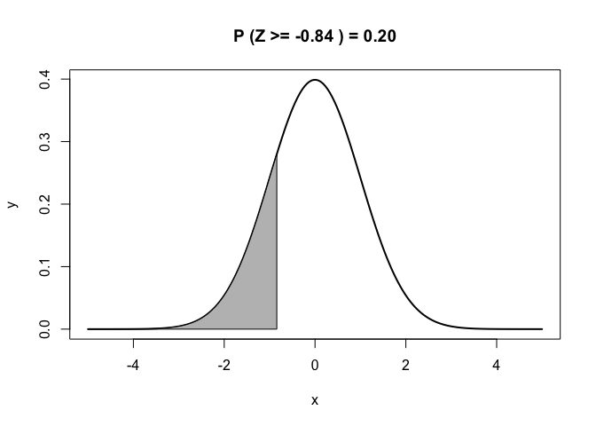

Chapter 3: Basic Statistics: A Review
================
Mimi Wang
12/1/2019

### Problem 3

Assume that Z is a normal random variable with mean 0 and variance 1.

**a.**  = ?")

``` r
# Get the probability
prob <- pnorm(-1, mean = 0, sd = 1, lower.tail = FALSE)

# Visualize
x1 <- seq(-5, 5, length = 200)
y1 <- dnorm(x1, mean = 0, sd = 1)
plot(x1, y1, lwd = 2, type = "l",
  xlab = "x", ylab = "y", main = paste("P (Z >= -1) =", round(prob, 3)))

x2 <- seq(-1, 5, length = 200)
y2 <- dnorm(x2, mean = 0, sd = 1)
polygon(c(-1, x2, 5), c(0, y2, 0), col = "gray")
```

<!-- -->

**b.**  = 0.20")

``` r
# Get the Limit
lim <- qnorm(0.20, mean = 0, sd = 1, lower.tail = TRUE)

# Visualize
x1 <- seq(-5, 5, length = 200)
y1 <- dnorm(x1, mean = 0, sd = 1)
plot(x1, y1, lwd = 2, type = "l",
  xlab = "x", ylab = "y", main = paste("P (Z >=", round(lim, 2), ") = 0.20"))

x2 <- seq(-5, lim, length = 200)
y2 <- dnorm(x2, mean = 0, sd = 1)
polygon(c(-5, x2, lim), c(0, y2, 0), col = "gray")
```

<!-- -->
