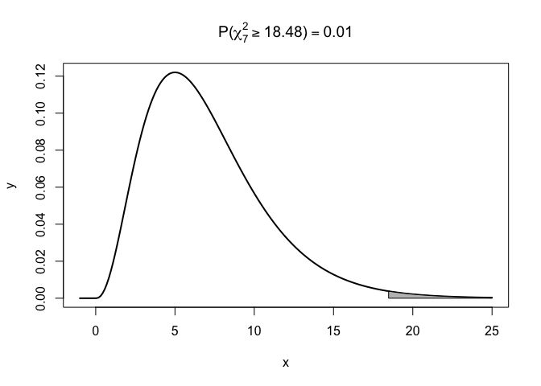
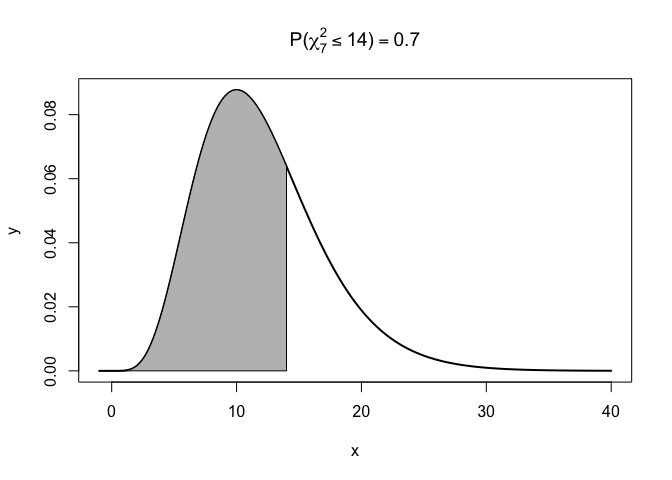

Chapter 3: Basic Statistics: A Review
================
Mimi Wang
12/1/2019

### Problem 4

**a.**  = 0.01")

``` r
# Get the limit
lim <- qchisq(0.01, df = 7, lower.tail = FALSE)

# Visualize
x1 <- seq(-1, 25, length = 200)
y1 <- dchisq(x1, df = 7)
plot(x1, y1, lwd = 2, type = "l",
  xlab = "x", ylab = "y", main = TeX(paste("$P(\\chi_7^2 \\geq", round(lim, 2),") = 0.01")))

x2 <- seq(lim, 25, length = 200)
y2 <- dchisq(x2, df = 7)
polygon(c(lim, x2, 25), c(0, y2, 0), col = "gray")
```

<!-- -->

**b.**  = ?")

``` r
# Get the Probability
prob <- pchisq(14, df = 12, lower.tail = TRUE)

# Visualize
x1 <- seq(-1, 40, length = 200)
y1 <- dchisq(x1, df = 12)
plot(x1, y1, lwd = 2, type = "l",
  xlab = "x", ylab = "y", main = TeX(paste("$P(\\chi_7^2 \\leq 14) =", round(prob, 2))))

x2 <- seq(-1, 14, length = 200)
y2 <- dchisq(x2, df = 12)
polygon(c(-1, x2, 14), c(0, y2, 0), col = "gray")
```

<!-- -->
