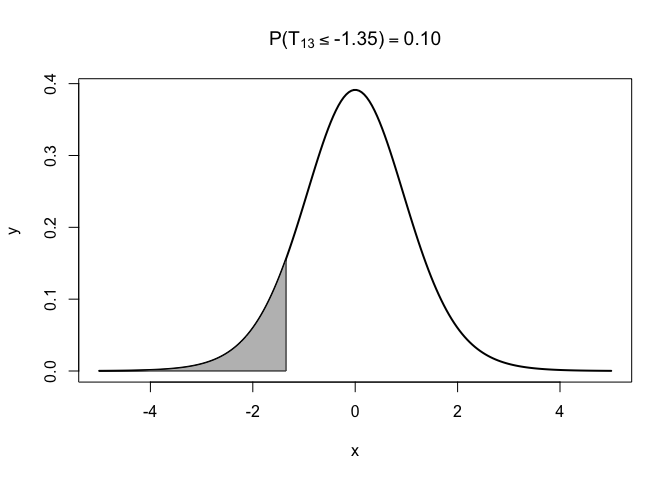
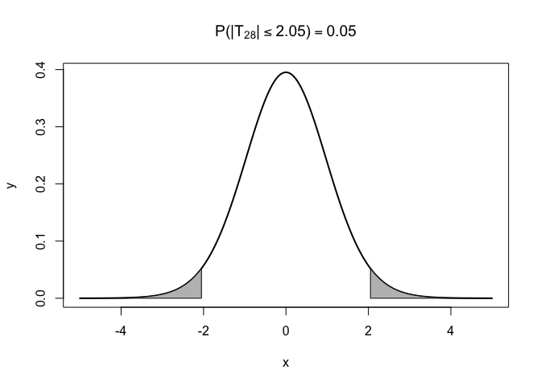

Chapter 3: Basic Statistics: A Review
================
Mimi Wang
12/1/2019

### Problem 5

**a.**  = 0.10")

``` r
# Get the Probability
lim <- qt(0.1, df = 13, lower.tail = TRUE)

# Visualize
x1 <- seq(-5, 5, length = 200)
y1 <- dt(x1, df = 13)
plot(x1, y1, lwd = 2, type = "l",
  xlab = "x", ylab = "y", main = TeX(paste("$P(T_{13} \\leq", round(lim, 2),") = 0.10")))

x2 <- seq(-5, lim, length = 200)
y2 <- dt(x2, df = 13)
polygon(c(-5, x2, lim), c(0, y2, 0), col = "gray")
```

<!-- -->

**b.**  = ?")

``` r
# Get the Probability
prob_lower <- pt(-2.05, df = 28, lower.tail = TRUE)
prob_upper <- pt(2.05, df = 28, lower.tail = FALSE)

prob <- prob_lower + prob_upper

# Visualize
x1 <- seq(-5, 5, length = 200)
y1 <- dt(x1, df = 28)
plot(x1, y1, lwd = 2, type = "l",
  xlab = "x", ylab = "y", main = TeX(paste("$P(|T_{28}| \\leq 2.05) =", round(prob, 2))))

x2 <- seq(-5, -2.05, length = 200)
y2 <- dt(x2, df = 28)
polygon(c(-5, x2, -2.05), c(0, y2, 0), col = "gray")

x2 <- seq(2.05, 5, length = 200)
y2 <- dt(x2, df = 28)
polygon(c(2.05, x2, 5), c(0, y2, 0), col = "gray")
```

<!-- -->
