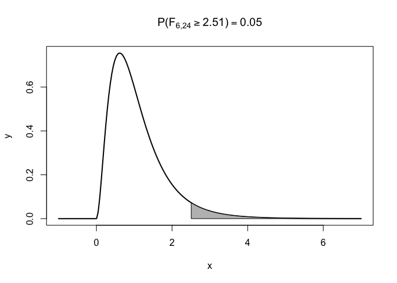
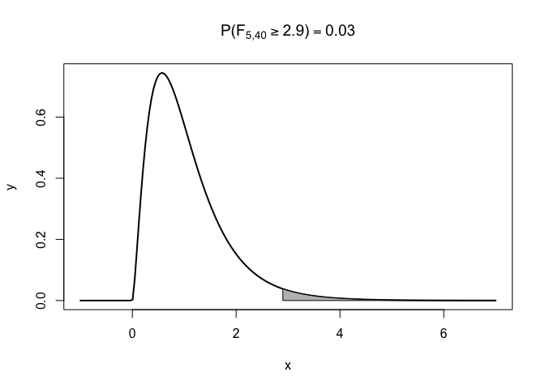

Chapter 3: Basic Statistics: A Review
================
Mimi Wang
12/1/2019

### Problem 6

**a.**  = 0.05")

``` r
# Get the Limit
lim <- qf(0.05, df1 = 6, df2 = 24, lower.tail = FALSE)

# Visualize
x1 <- seq(-1, 7, length = 200)
y1 <- df(x1, df1 = 6, df2 = 24)
plot(x1, y1, lwd = 2, type = "l",
  xlab = "x", ylab = "y", main = TeX(paste("$P(F_{6, 24} \\geq", round(lim, 2),") = 0.05")))

x2 <- seq(lim, 7, length = 200)
y2 <- df(x2, df1 = 6, df2 = 24)
polygon(c(lim, x2, 7), c(0, y2, 0), col = "gray")
```

<!-- -->

**b.**  = ?")

``` r
# Get the Probability
prob <- pf(2.9, df1 = 5, df2 = 40, lower.tail = FALSE)

# Visualize
x1 <- seq(-1, 7, length = 200)
y1 <- df(x1, df1 = 5, df2 = 40)
plot(x1, y1, lwd = 2, type = "l",
  xlab = "x", ylab = "y", main = TeX(paste("$P(F_{5, 40} \\geq 2.9) =", round(prob, 2))))

x2 <- seq(2.9, 7, length = 200)
y2 <- df(x2, df1 = 5, df2 = 40)
polygon(c(2.9, x2, 7), c(0, y2, 0), col = "gray")
```

<!-- -->
